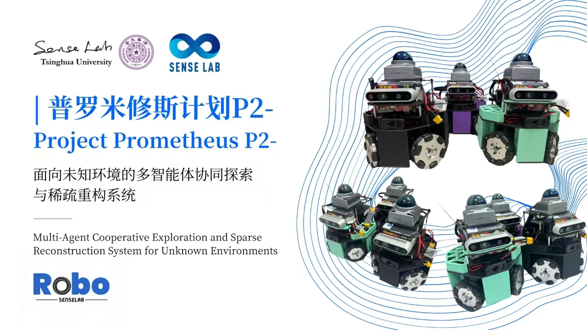
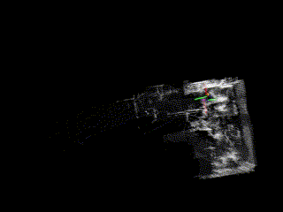

# SenseServer



SenseServer is the server side of the [SenseBeetle](https://github.com/senselabrobo/SenseBeetle) and is responsible for stitching multi-machine maps. The code is based on [Autonomous Exploration Development Environment](https://github.com/HongbiaoZ/autonomous_exploration_development_environment), and adapted to the ROS2 environment.

<div align=center></div>

## Download

```bash
cd ~/
git clone https://github.com/senselabrobo/SenseServer
```

## Installation

### Dependencies

```bash
cd ~/SenseServer
sudo apt update
sudo apt install ros-humble-desktop-full python3-rosdep ros-humble-pcl* ros-humble-foxglove-bridge -y
sudo rosdep init
rosdep update
rosdep install -r --from-paths src --ignore-src --rosdistro $ROS_DISTRO -y
```

## Configuration

Be sure to turn off the firewall before running the code.

Open the file ~/SenseServer/src/multi_transform/launch/multi_transform.launch.py and modify the network_ip to be the server ip, and network_port to be the server port.

## Build

```bash
bash ~/SenseServer/toBuild.sh
```

## Run

Replace [robot_count] with the number of bots (Max id+1, currently 1-5 supported).

```bash
bash ~/SenseServer/run.sh [robot_count]
```